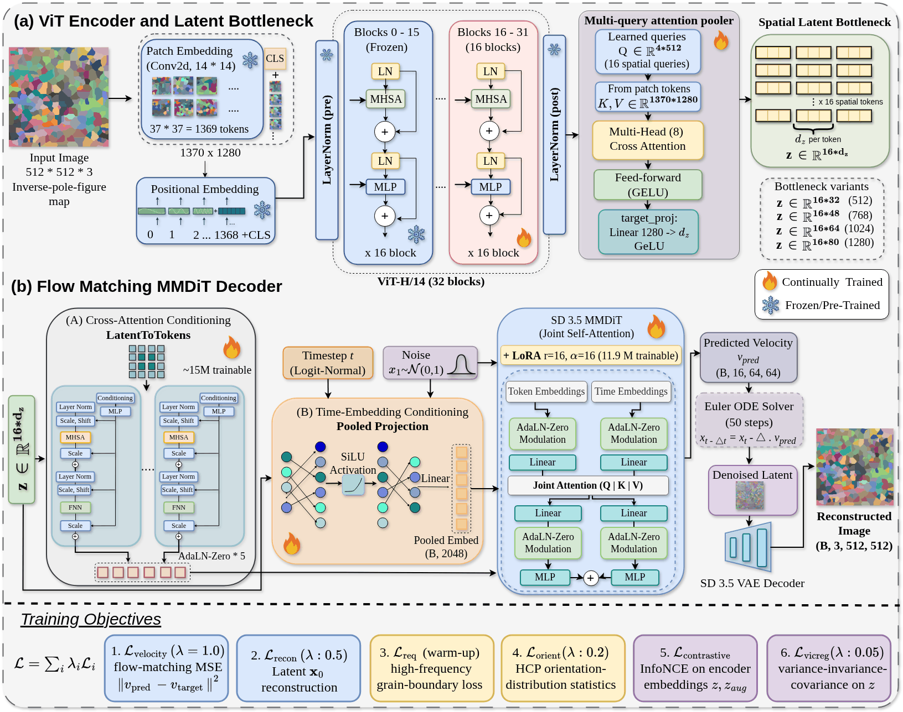

# Model

Architecture, training objective and baselines of the microstructure encoder–decoder.

## FM-DiT: the main model, four bottleneck widths

| Model | Per-token width d_z | Latent z | Dimension d | Compression vs 512×512×3 |
|---|---|---|---|---|
| FM-DiT-512 | 32 | 16 × 32 | 512 | 1536× |
| FM-DiT-768 | 48 | 16 × 48 | 768 | 1024× |
| FM-DiT-1024 | 64 | 16 × 64 | 1,024 | 768× |
| FM-DiT-1280 | 80 | 16 × 80 | 1,280 | 614× |

All four widths share one architecture and one code path (`microstructure_ed/fmdit/`); only `target_dim` differs.

<em>(a) ViT-H/14 encoder with a 16-query attention pooler and a spatial latent bottleneck. (b) Flow-matching decoder: the latent conditions a frozen SD3.5 MMDiT through the LatentToTokens adapter and a pooled projection, with LoRA on the backbone. Bottom: terms of the training objective. The released v4 models use LoRA rank 64 on attention and feed-forward projections, and were evaluated with 25 Euler steps.</em>

- **Encoder** (`microstructure_ed/encoder_arch_pretrained.py`):
  - Backbone: OpenCLIP **ViT-H/14** pretrained on LAION-2B (32 blocks, width 1,280). The lower 16 blocks are frozen and the upper 16 are fine-tuned from epoch 8.
  - Pooling: a multi-query attention pooler with **16 learned queries** (cross-attention to the patch tokens, then self-attention), followed by a per-token projection 1,280 → d_z.
  - Input: the 300 × 300 orientation image, upsampled with nearest-neighbour interpolation to 512 × 512, so grain colours stay piecewise constant.
- **Decoder** (`microstructure_ed/fmdit/decoder_arch_pretrained.py`):
  - Backbone: a **frozen Stable Diffusion 3.5 medium MMDiT** (2.5 B parameters) with its VAE.
  - Conditioning: a token adapter maps the 16 latent tokens through self-attention blocks into the joint-attention stream, replacing the text tokens. A pooled projection modulates the backbone together with the timestep embedding.
  - Fine-tuning: **LoRA** (rank 64, alpha 64) on the attention and feed-forward projections, enabled from epoch 4. Conditioning is dropped for 10 % of samples, which enables classifier-free guidance.
  - Sampling: Euler integration of the learned velocity field.
- **Training objective** (`composite_fm_loss`, `microstructure_ed/orientation_loss.py`): the rectified-flow velocity loss plus
  - clean-latent reconstruction;
  - a high-frequency spectral loss against blurred grain boundaries;
  - InfoNCE between augmented views;
  - VICReg, which keeps z bounded and decorrelated;
  - latent-statistics matching;
  - an auxiliary texture head;
  - an **HCP-symmetric orientation-distribution loss**. It pushes predicted images through a differentiable codec inverse and compares basal/prismatic pole-figure KDEs, disorientation-kernel MMD, the misorientation distribution, orientation scatter and a matched-pixel anchor.

## Baselines

| Baseline | Decoder | Latent | Code |
|---|---|---|---|
| ViT-DiT | DiT-XL/2 (`facebook/DiT-XL-2-256`, fully fine-tuned) + `sd-vae-ft-mse` | 512, global | `microstructure_ed/baselines/vitdit/` |
| ViT-SDXL | frozen SDXL-base-1.0 UNet (latent diffusion), trained token and pooled projections | 512, global | `microstructure_ed/baselines/vitsdxl/` |
| ViT-VQGAN | PaintMind `vit-s-vqgan`, 256 × 256 | discrete tokens, no continuous bottleneck | `microstructure_ed/baselines/vitvqgan/` |

ViT-DiT and ViT-SDXL use the same ViT-H/14 encoder with a **global** bottleneck: 4 pooler queries merged into a single 512-D vector (`spatial_tokens=0`). Only FM-DiT uses the 16-token spatial latent. ViT-VQGAN has no continuous latent and serves as a reconstruction reference.
