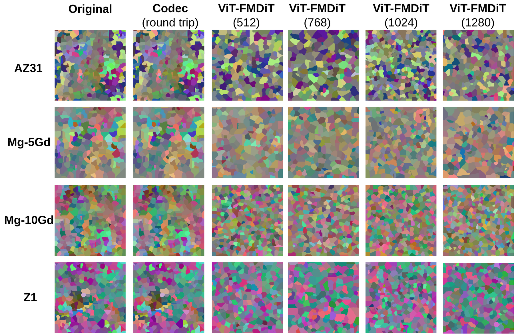
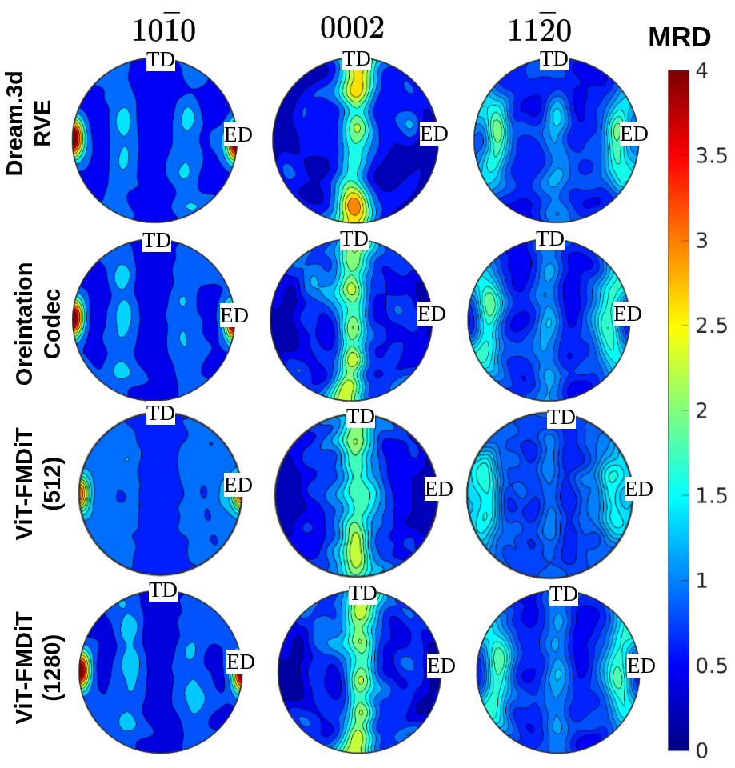

# Results

## Reconstruction fidelity

Reconstruction fidelity on the held-out test set (n = 10,100 RVEs) at the 300 × 300 resolution the crystal-plasticity oracle sees. Grains are segmented identically on originals and reconstructions with Segment Anything. Values are mean ± standard deviation; FID is a single distribution-level value.

| Model | FID ↓ | MS-SSIM ↑ | LPIPS ↓ | Grain size rel. error ↓ | Orientation EMD (°) ↓ | Mean disorientation (°) ↓ |
|---|---|---|---|---|---|---|
| FM-DiT-512 | 26.63 | 0.065 ± 0.040 | 0.576 ± 0.023 | 0.131 ± 0.120 | 8.606 ± 1.372 | 4.057 ± 2.086 |
| FM-DiT-768 | 27.24 | 0.065 ± 0.038 | 0.575 ± 0.024 | 0.122 ± 0.115 | 8.515 ± 1.383 | 3.993 ± 2.041 |
| FM-DiT-1024 | 25.37 | 0.064 ± 0.037 | 0.573 ± 0.023 | 0.101 ± 0.083 | 8.451 ± 1.329 | 3.938 ± 2.025 |
| FM-DiT-1280 | 25.00 | 0.065 ± 0.039 | 0.574 ± 0.024 | 0.112 ± 0.107 | 8.398 ± 1.346 | 3.907 ± 1.973 |

<em>Held-out RVEs of four alloy classes at 300 × 300: original, orientation-codec round trip, and the four FM-DiT widths.</em>

The pole figures below test the reconstructions on the texture itself, the quantity that controls the mechanical anisotropy. AZ31 carries a sharp basal fibre; Mg-5Gd keeps the same fibre topology but broadened and weakened by Gd in solution. The codec and the decoders preserve this alloy contrast. FM-DiT-512 places the basal maximum correctly but under-sharpens it, and FM-DiT-1280 recovers most of the missing intensity.

<table>
<tr>
<td align="center"> <em>AZ31</em></td>
<td align="center"> <em>Mg-5Gd</em></td>
</tr>
</table>

<em>Recalculated {10-10}, {0002} and {11-20} pole figures (MRD, common 0–4 scale; ED horizontal, TD vertical). Rows: DREAM.3D reference RVE, orientation-codec round trip, and the FM-DiT-512 and FM-DiT-1280 reconstructions of the same RVE.</em>

Decodes reproduce the grain-size, grain-shape and texture statistics of the target, not the position of individual grains. This is the intended operating point for a latent space small enough to search, and it is why the materials metrics are the ones to read. FM-DiT-512 is the decoder used for the MERIDIAN design runs.

## Training data

<em>Pole-figure validation of the training data for one alloy class. Rows: experimental ODF, the DREAM.3D RVE built from it, and two independently oversampled synthetic ODFs. The synthetic textures redistribute intensity within the measured fibre rather than creating new components.</em>

